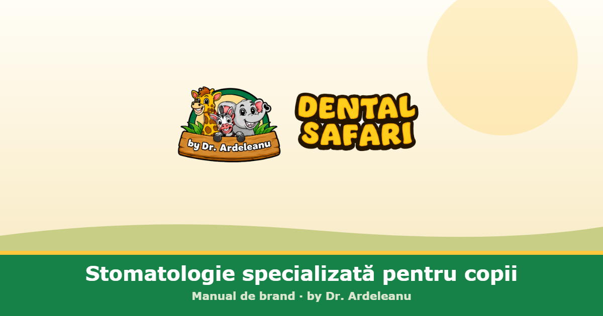

# Dental Safari — Manual de brand

> **Stomatologie specializată pentru copii.** · *La dentist ca într-o aventură.*
> Manualul de brand al clinicii **Dental Safari by Dr. Ardeleanu** — sistem strategic, verbal și vizual.

## Despre

Acesta este manualul de brand interactiv Dental Safari, într-un singur fișier HTML, complet offline (fonturi, imagini și ilustrații înglobate). Se deschide prin dublu-click, fără internet și fără dependențe.

**`index.html`** conține tot manualul: navigație laterală, bară de progres la derulare și paletă cu copiere HEX la click.

## Cuprins

| # | Capitol |
|---|---------|
| 00 | Cum folosești manualul |
| 01 | Esența brandului |
| 02 | Promisiune & poziționare |
| 03 | Povestea & personajele (Eddie, Zara, Grace) |
| 04 | Sistem vizual — logo, **sistem cromatic**, tipografie |
| 05 | Logo: cele două modele & proporții |
| 06 | Imagine și conținut |
| 07 | Voce & mesaje |
| 08 | Aplicații |
| 09 | Surse și note |
| 10 | **Materiale de brand** — bannere, ruletă, roll-up, fișe de lucru |
| 11 | **Educăm Zâmbete Sănătoase** — campania în școli (mascota Dințișorul, flyer, fișă, diplomă, orar) |

## Cum se folosește

- **Local:** deschide `index.html` în orice browser modern.
- **GitHub Pages:** activează Pages pe branch-ul `main`, folder `/ (root)` — manualul va fi servit automat ca pagină web (fișierul se numește `index.html`).

## Sistem cromatic (rezumat)

| Token | HEX | Rol |
|-------|-----|-----|
| Jungle Green | `#168247` | culoare dominantă, arcul logoului |
| Safari Yellow | `#FFC83D` | accent-semnătură, umplutura wordmark |
| Safari Gold | `#FAA703` | umbrele & extrudările literelor |
| Deep Bark | `#2D210F` | contur logo & text de corp |
| Warm Cream | `#FFF8E7` | fundal principal |

> Valorile CMYK / Pantone din manual sunt aproximative și se confirmă cu probe de tipar.

## Versiune

**v1.2** · iunie 2026 · *by Dr. Ardeleanu*

---

© Dental Safari. Toate drepturile rezervate. Personajele și ilustrațiile sunt elemente de brand protejate.
